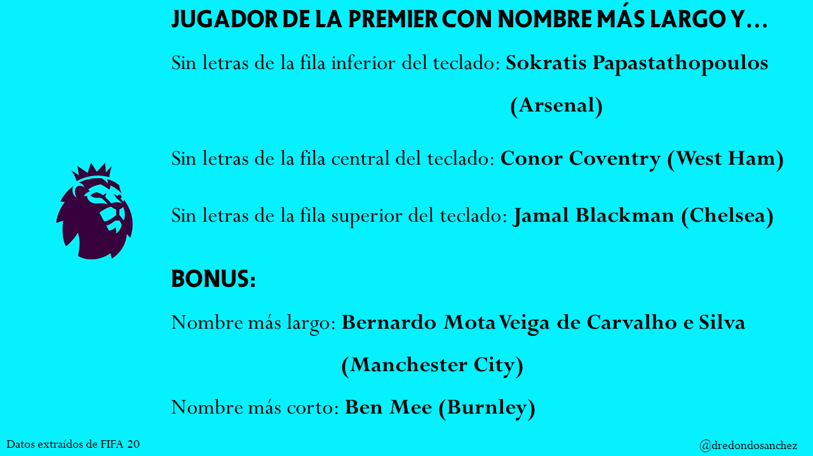

# Análisis de los nombres más largos de jugadores de la Premier League sin letras de alguna fila del teclado.

Los resultados del análisis aparecieron en el directo "JUEVES DE PARDS 1x32" del canal de Youtube de La Media Inglesa: https://www.youtube.com/watch?v=H8zrArsdtIk

Datos de FIFA 20 extraídos de Kaggle: https://www.kaggle.com/stefanoleone992/fifa-20-complete-player-dataset#players_20.csv